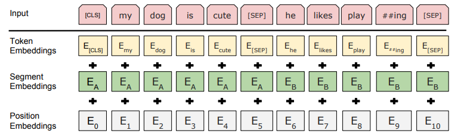

# Bert  
基于transformers实现的双向自编码模型   

----

#### 介绍  

- 双向自编码模型，相比于自回归模型带来的性能优势     
- 同时面向sentence-level tasks和token-level task     
- pre-train模型的两种应用策略:  
1、基于特征表示应用在下游任务  
2、直接在pre-train的基础上进行fine-tuning，使得模型直接试应下游任务  

- pre-train阶段模型的训练目标  
1、masked word prediction
引入自编码模型来缓解单向模型的缺陷，对模型输入进行随机mask，然后根据上下文信息来预测masked word   
2、next sentence prediction  
主要为了学习句子级别的上下问关系，提升对sentence-level tasks的表现  

#### 模型      

##### 1、输入输出表示  

  

    
- 单个输入序列可以是一个句子或者一对句子  
- [CLS]是输入序列的第一个特殊标识，可以作为后续分类任务的标识，编码了整个输入序列的信息  
- [SEP]标识为为了区别分隔前后句子，前面提到输入序列可以是一个句子也可以是一对句子，区别序列中token属于
前一个句子还是后一个句子，有两种方法，第一个就是[SEP]标识，第二个就是图片中呈现的Segment Embeddings，
- 输入token的标识由三部分组成，如图所示    
Token Embeddings:token的语言向量  
Segment Embeddings:token属于前一个句子还是后一个  
Position Embeddings:自编码模型失去位置信息，这个可以通过Pos embedding来弥补，transformer中
通过固定公式来引入，在Bert中则使用单独的可训练embedding来学习  

  
  
 

